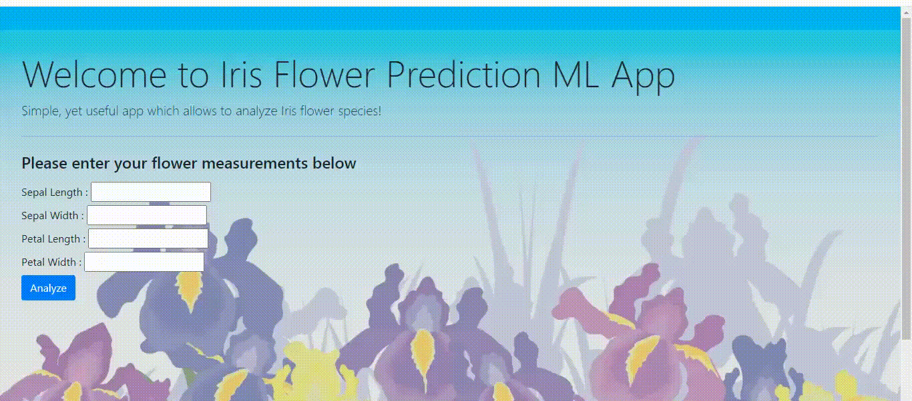

# Iris Flower Prediction ML App
ML app for predicting Iris flower species based on given features.

### Built with
+ [pandas](https://pandas.pydata.org/) - fast, powerful, flexible and easy to use open source data analysis and manipulation tool
+ [Scikit-learn](https://scikit-learn.org/stable/) - Simple and efficient tools for predictive data analysis
+ [TensorFlow](https://www.tensorflow.org/) - An end-to-end open source machine learning platform
+ [Keras](https://keras.io/) - Deep Learning framework

## Iris Flower App
Let's try out on [heroku](https://iris-flower-app-by-ptyadana.herokuapp.com/).

## Iris Flower REST API Endpoint
```/api/iris``` POST: get the flower prediction

#### Sample JSON
```javascript
{"sepal_length":5.1,
"sepal_width":6,
"petal_length":1.4,
"petal_width":4}
```



### References
This is based on final project of [Complete Tensorflow 2 and Keras Deep Learning Bootcamp](https://www.udemy.com/course/complete-tensorflow-2-and-keras-deep-learning-bootcamp/) with additional tweaks.

